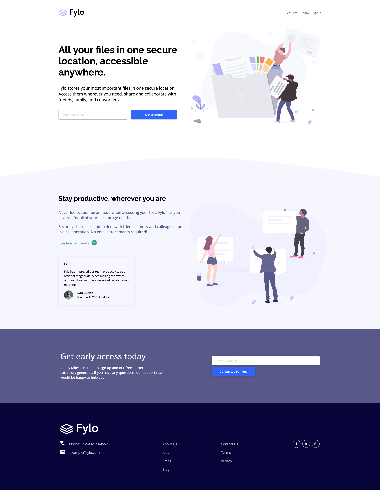
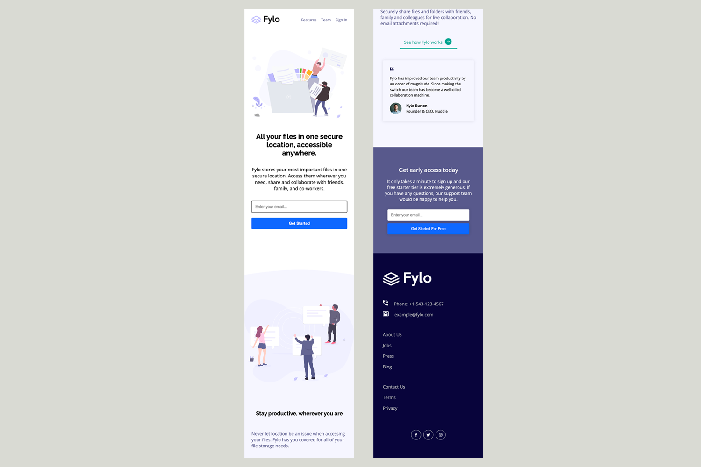

### Links

- [Frontend Mentor Solution](https://www.frontendmentor.io/solutions/fylo-landing-page-with-two-column-layout-VSjrTvh_kq#comment-63a0ed8ea0148959371c8868)
- [Live Site URL](https://smgy94.github.io/frontend-mentor-fylo-landing-page-with-two-column-layout/)

# Frontend Mentor - Fylo landing page with two column layout solution

This is a solution to the [Fylo landing page with two column layout challenge on Frontend Mentor](https://www.frontendmentor.io/challenges/fylo-landing-page-with-two-column-layout-5ca5ef041e82137ec91a50f5). Frontend Mentor challenges help you improve your coding skills by building realistic projects.

## Table of contents

- [Links](#links)
- [The challenge](#the-challenge)
- [Screenshot](#screenshot)
- [Built with](#built-with)
- [Useful resources](#useful-resources)
- [Author](#author)

### The challenge

Users should be able to:

- View the optimal layout for the site depending on their device's screen size
- See hover states for all interactive elements on the page

### Screenshot

### Built with

- Semantic HTML5 markup
- CSS custom properties
- Flexbox
- CSS Grid
- Mobile-first workflow
- Javascript

### Useful resources

- [Email Validation in HTML CSS and JavaScript ](https://www.codinglabweb.com/2021/07/Email-Validation-in-HTML-CSS-JavaScript.html) - This helped me with Javascript email validation. I really liked this pattern and will use it going forward.

## Author

- LinkedIn - [ShaneMcGeown](https://www.linkedin.com/in/shanemcgeown)
- Frontend Mentor - [@Smgy94](https://www.frontendmentor.io/profile/Smgy94)
- Twitter - [@ShaneMcGeown94](https://twitter.com/ShaneMcGeown94)
